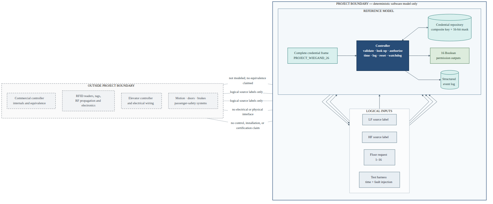
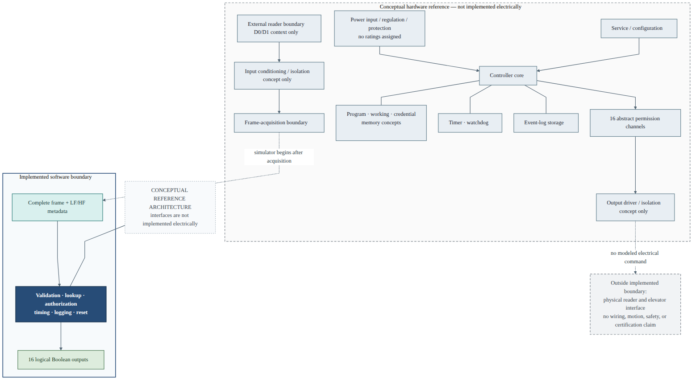
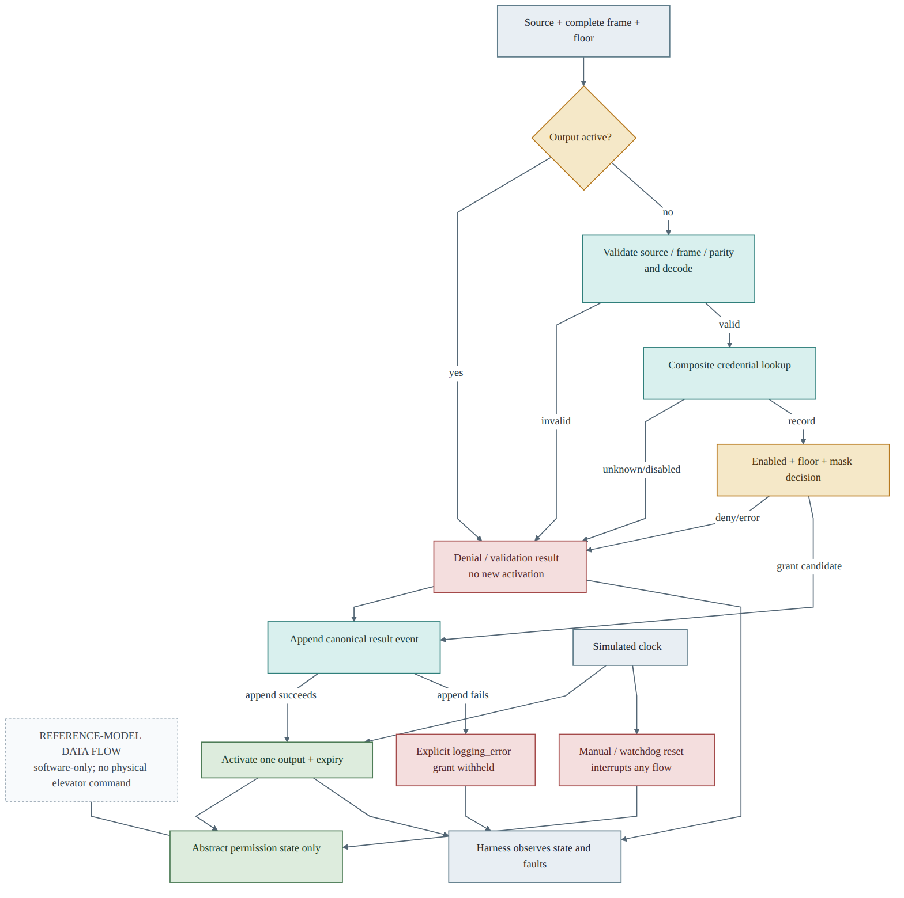
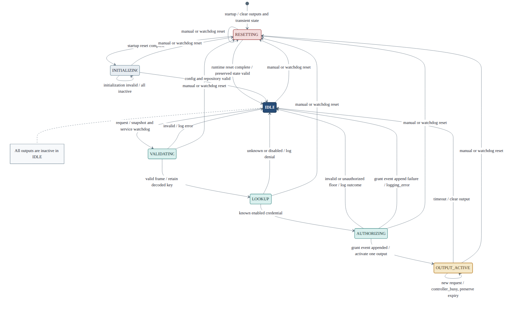
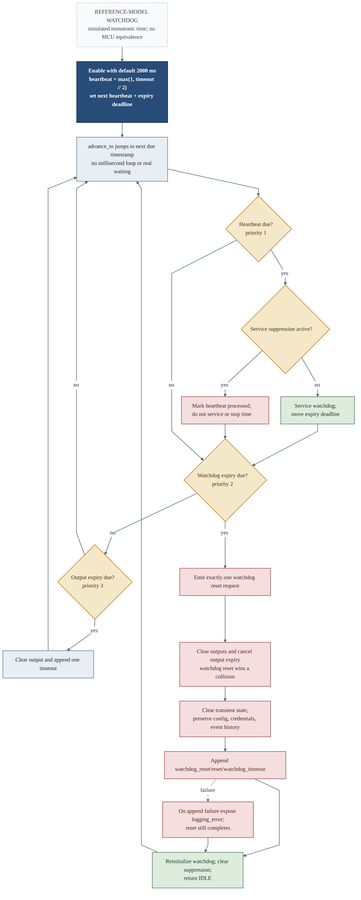
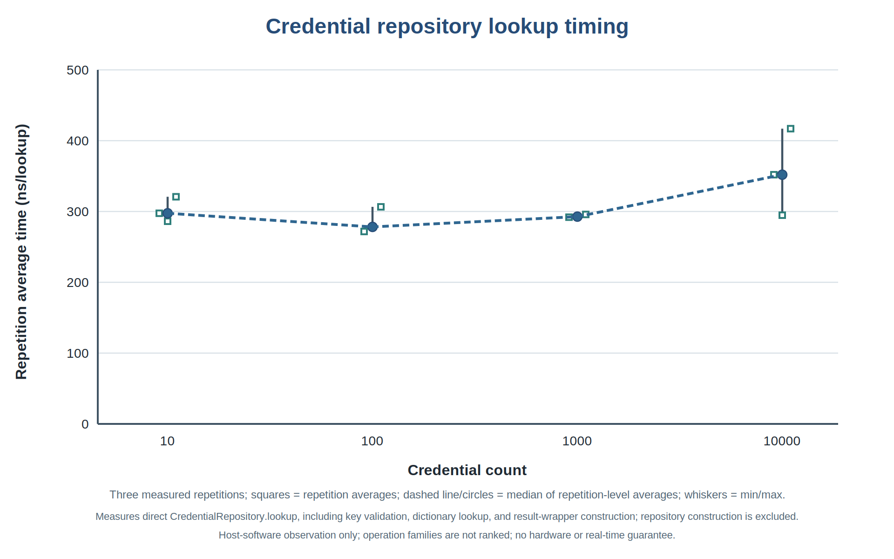
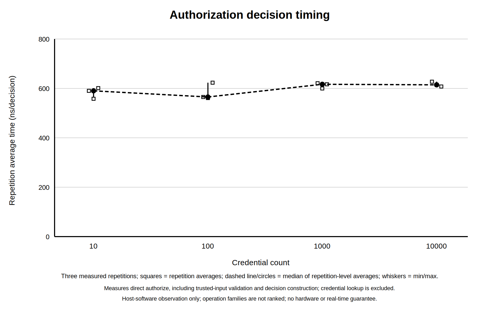

# Final Project Controlled Floor Elevator

**B.Sc. Final Engineering Project Report**

**Student:** Bar Shtainvortzel

**Supervisor:** Professor Gadi Golan

**Department of Electrical and Electronics**

**Faculty of Engineering**

**Ariel University**

**Fourth year**

## 1. Abstract

Floor-selective elevator access requires a controller to validate a credential, retrieve its authorization record, decide whether a requested floor is permitted, activate the corresponding permission signal for a bounded interval, and record the outcome. This project specified, architected, implemented, and verified a deterministic software reference model for that authorization function. The Python model supports two logical reader-source labels, a project-defined 26-bit credential profile with parity checking, composite-key credential lookup, 16-bit floor permissions, explicit grant and denial decisions, single-output activation, busy handling, structured event logging, deterministic simulated time, reset, and watchdog recovery. Requirements-to-test traceability covered all 60 required requirements, and the implementation verification milestone recorded 976 collected and passed tests. Quantitative experiments reconciled 39,000 mixed controller requests and 24,000 isolated lookup and authorization operations with their constructed expected outcomes; the isolated matrices contained zero mismatches or incorrect authorization outcomes. Timing measurements covered four repository sizes on one recorded host with three measured repetitions per size and operation. The principal limitation is that the work evaluates a controlled host-software model rather than physical RFID electronics, an elevator interface, passenger-safety functions, or the motivating commercial controller. The contribution is therefore a reproducible and quantitatively evaluated authorization reference design, not a physical elevator-control product.

## 2. Introduction

### Engineering motivation

An elevator access layer can be modeled as a selective authorization problem: a credential identifies a record, the record carries permissions, and a floor request is granted only when the corresponding permission is present. Separating this decision from motion control is useful because it yields an explicit and testable boundary. The model can answer whether an abstract floor-permission signal should be active without attempting to command doors, motors, brakes, or any passenger-safety function.

RFID concepts are relevant because many access systems organize information around tags or credentials, readers, and downstream processing. NIST describes RFID systems in terms of tags, readers, and enterprise subsystems, while also distinguishing operating-frequency classes from identifier formats [1]. Reader-to-controller signaling is a separate layer. BALTECH's Wiegand documentation illustrates a bounded implementation in which D0 and D1 pulses encode bits and frame formats may include parity [2]. These sources motivate the conceptual input boundary; neither establishes a property of the commercial item that prompted this project.

Authorization is the central engineering function. General access-control guidance calls for managed authorization credentials or access lists, verification before access is granted, and audit records of physical-access events [3]. The project translates those broad concepts into a deterministic software reference model: a composite credential key, a 16-bit permission mask, an explicit grant/deny decision, a timed logical output, and a structured event record. Those are project choices, not recovered commercial behavior.

### Objective and scope

The objective was to specify, architect, implement, verify, and quantitatively evaluate a deterministic Python model of a 16-floor access-authorization controller under controlled software inputs. The model begins with a complete logical credential frame, an `LF` or `HF` source label, and one requested floor. It ends with a typed decision, one of 16 abstract Boolean permission channels, and an event record. `LF` and `HF` are metadata labels only; they do not simulate radio propagation, antennas, modulation, reader electronics, or physical frequency detection.

The motivating commercial listing and the project-specific reference model must remain distinct. The owner-supplied listing URL identifies the intended item, but no preserved listing capture or manufacturer documentation supports a technical characterization. Consequently, the report does not present the project model as reverse engineering, a commercial implementation, or an equivalent replacement.

The engineering boundary is summarized in Figure 1. Inputs are complete logical messages rather than electrical pulses, while outputs are permission states rather than elevator commands.

{#fig-system-context width=100%}

### Engineering contribution

The completed contribution is a deterministic software reference model that joins protocol validation, credential management, authorization, output timing, controller state, logging, fault injection, reset, watchdog recovery, automated verification, and reproducible experiments in one coherent design. Its significance lies in making each decision, state transition, timing event, and limitation explicit and testable. The work does not claim that the motivating commercial product uses the same internal design, and it does not control elevator motion, doors, brakes, or passenger-safety functions.

### Report organization

Section 3 defines the motivating product context and its evidence boundary. Section 4 explains the research method. Section 5 reviews relevant technical literature. Sections 6–8 define the requirements, reference architecture, and Python implementation. Sections 9–11 present verification, quantitative results, and engineering interpretation. Sections 12–13 consolidate limitations, conclusions, and future work. Sections 14–15 provide references and supporting reproducibility material.

## 3. Motivating Product Context and Evidence Boundary

### Preserved identification evidence

The commercial item that motivated the study is identified by two preserved forms of the same AliExpress URL: the original URL and a canonical item URL. Direct listing content and a local capture were unavailable. The URL therefore identifies the motivating listing but establishes no technical product characteristic.

No product image is included. Original imagery, its provenance, and permission to reproduce it are unavailable. There are also no preserved readable component markings, seller technical statements, schematics, or manufacturer documents. These gaps prevent image-based or document-based inspection of the item.

### Current technical unknowns

Table 1 records unknowns rather than negative findings.

**Table 1. Evidence boundary for the motivating commercial product.**

| Topic | Evidence status | Permitted conclusion |
|---|---|---|
| Processor or controller architecture | No marking, schematic, or manufacturer manual is available | The commercial processor architecture and specific MCU remain unknown |
| RFID technology | No product-specific technical source is available | Commercial frequencies, credential technologies, and smart-card protocols remain unknown |
| Reader/controller signaling | No supported interface description is available | Commercial Wiegand support, frame formats, and direction remain unknown |
| Electrical output | No datasheet or circuit evidence is available | Output topology, isolation, voltage, and current characteristics remain unknown |
| Elevator interface | No wiring or installation document is available | Physical connection and behavior at an elevator interface remain unknown |
| Firmware | No firmware image, source, or architecture document is available | Commercial firmware architecture and behavior remain unknown |
| Compliance and safety | No authoritative certificate or safety assessment is available | Certification and safety behavior remain unknown |

Absence of preserved evidence is not evidence that the product lacks any listed technology or property. It only prevents an affirmative technical attribution. Representative ARM, STM32, and Marvell literature used elsewhere in this report is not substituted for missing product evidence. Likewise, the project-defined RFID labels, 26-bit frame, credential store, outputs, watchdog, and event log describe the proposed reference model and must not be read as observations of the commercial item.

## 4. Research Methodology and Limitations

### Evidence-based method

The study applied a source hierarchy to keep claims proportional to their support. Directly preserved material about the item was treated as product evidence. Manufacturer manuals and government or vendor guidance were used only within their documented scope. Reasoned interpretations were distinguished from project-specific design choices, and executed software outcomes were separated from physical or commercial claims. Information not established by these sources remained explicitly unknown.

Major technical claims were mapped to their supporting literature, requirements, implementation, tests, or experiment records. A source was not used beyond its documented boundary. In particular, an embedded-controller manual can explain a representative reset or watchdog concept but cannot identify the commercial controller; a simulator test can verify modeled reset behavior but cannot validate a physical safety response.

### Model construction and verification discipline

The proposed system boundary was frozen before implementation. Requirements defined observable behavior and exclusions; architecture assigned state ownership and ordering; the software design specified immutable data boundaries, manager responsibilities, failure policy, and simulated time. The Python implementation then used generated complete frames, validated startup data, an in-memory repository, and an injectable monotonic clock. Identical controlled inputs, initial state, configuration, and time schedule were expected to produce identical logical decisions and normalized events.

Requirements-to-test traceability connected every required requirement to at least one planned and then executed test or inspection. The approach is consistent with NASA software-engineering guidance on bidirectional traceability, controlled test procedures, unit testing, and evaluation of results against criteria [4]. That guidance informed verification discipline; it did not independently validate this implementation.

Quantitative experiments were defined separately from logical-time tests. Constructed workloads were regenerated from recorded configurations and seeds. Host execution was instrumented with `time.perf_counter_ns`, whereas controller time remained simulated. Mixed controller processing, direct repository lookup, and direct authorization were measured as different operation boundaries. Artifact-consistency checks reconciled source hashes, counts, tables, and figures without adding or replacing measurements.

### Limitations of the method

The method controls overstatement but does not remove missing evidence. It is not an exhaustive review of every RFID, access-control, embedded, or elevator-integration source. Administrative decisions do not constitute technical proof. Deterministic simulation evaluates the proposed software contracts only. Unresolved product, physical-integration, and safety information remains explicit rather than being filled with general knowledge.

## 5. Literature Review

### RFID concepts and technology layers

NIST SP 800-98 describes general RFID systems as combinations of tags, readers, and processing subsystems, and discusses passive and active tags, operating ranges, data characteristics, and security risks [1]. For this report, the important systems insight is that carrier-frequency class, credential or identifier format, and downstream reader output are different characteristics. An LF or HF category cannot be inferred from a controller-side 26-bit credential value, and a frequency class does not itself determine a Wiegand frame.

The project therefore represents `LF` and `HF` only as externally supplied logical metadata. General literature can explain low- and high-frequency classes, but it cannot assign either class, a credential technology, or a smart-card protocol to the commercial item. Detailed protocol coverage was not needed to verify the selected abstract authorization boundary and remains a potential literature extension.

### Wiegand signaling and frame concepts

BALTECH documents its reader behavior using D0 and D1 data wires, low pulses for binary symbols, variable message sizes, and frame formats that may include leading even and trailing odd parity [2]. This is useful evidence for the existence of those bounded signaling and framing concepts. It is not a universal electrical Wiegand standard, does not define all implementations, and does not demonstrate that the commercial product supports Wiegand.

The exact `PROJECT_WIEGAND_26` allocation used here is consequently a project-specific profile. External literature supports the general ideas of serial bit representation, frame length, and parity; the field positions and parity coverage used by the simulator are controlled design decisions.

### Authorization and auditability

NIST SP 800-53 Rev. 5 addresses authorization credentials, approved access lists, verification before granting access, and maintenance of access audit logs in organizational physical-access controls [3]. These principles support separating credential lookup, authorization decision, output action, and event recording. They do not prescribe the simulator's tuple key, 16-bit floor mask, in-memory data structure, denial precedence, or event schema. Those details were chosen to make the reference model bounded, deterministic, and testable.

### Representative embedded-controller literature

The STMicroelectronics RM0008 reference manual describes memory organization, reset and clock control, GPIO, interrupts, timers, watchdogs, and communication peripherals for specified STM32F10xxx devices [5]. The ARM Developer Suite guide supplies historical context for initialization, exception handling, ROM-oriented development, memory maps, and debugging [6]. The ARMv7-A/R Architecture Reference Manual defines A- and R-profile concepts and explicitly separates its scope from the M-profile documentation used for microcontroller architectures [7]. ARMv7-A/R is therefore not Cortex-M documentation. The Marvell ARMADA 38x specification is used only as an example of functional-specification organization, including subsystem descriptions, address-map presentation, boot flow, timers, and watchdog material [8].

All four are representative literature. STM32 material does not establish the commercial controller's MCU; ARM material does not establish any commercial processor; and ARMADA is neither a selected project processor nor product evidence. Their value is in disciplined terminology and documentation structure, not attribution.

### Verification literature and remaining gaps

NASA handbook guidance supports traceability from requirements to verification, controlled procedures and expected results, unit and integration levels, and evaluation of outcomes [4]. The project applied those ideas through a test inventory, a requirements traceability matrix, executed verification records, reproducible configurations, and independent quantitative review.

Authoritative physical elevator-integration literature and application-specific safety terminology were not available in the accepted source set. Those gaps are nonblocking for an abstract software model but prevent wiring, installation, physical reliability, or safety conclusions. Educational ARM files with incomplete author or date metadata were not promoted into the bibliography. The cited sources below are limited to records whose metadata and intended use were accepted for this draft.

## 6. Requirements and System Boundary

### Accepted requirement inventory

The accepted catalog contains 66 requirements: 60 required and six optional. All 60 required rows are verified in the accepted implementation scope. The six optional rows remain deferred and are not presented as implemented. They concern additional Wiegand profiles, additional authorization policies, persistent local credentials, enhanced interfaces, physical adapters, and extra experiment sizes.

The required system is a deterministic software-only access-authorization layer. It starts after physical signal acquisition, with one complete frame, one logical reader-source label, and one requested floor. It ends at a typed outcome, structured event, and 16 Boolean permission-output channels. It does not include RF behavior, physical readers, voltage/current interfaces, elevator wiring, movement, motors, brakes, doors, passenger-safety logic, installation, or certification.

Table 2 summarizes the requirements that define the central engineering behavior. The complete catalog and its requirement-to-test mapping are retained with the project archive.

**Table 2. Principal engineering requirements and verification status.**

| Identifier | Requirement | Verification method | Status |
|---|---|---|---|
| SCP-002, SCP-005 | Restrict operation to a software authorization layer with no required hardware | Architecture inspection and environment tests | Verified |
| SCP-003, FUN-002 | Accept and retain `LF` or `HF` as logical reader-source metadata | Unit and integration tests | Verified |
| FUN-003–FUN-006, DAT-001–DAT-003 | Validate and decode the project-defined 26-bit frame, including both parity regions | Boundary, corruption, and reference-vector tests | Verified |
| FUN-007–FUN-010, DAT-004–DAT-006 | Perform composite-key lookup and 16-bit floor-mask authorization | Unit tests and exhaustive floor-bit cases | Verified |
| FUN-011–FUN-015 | Enforce single-output activation, busy precedence, timeout, and recovery | State, timing, integration, and end-to-end tests | Verified |
| TIM-001–TIM-003 | Apply bounded logical timing through an injectable monotonic clock | Configuration and simulated-time boundary tests | Verified |
| LOG-001–LOG-003 | Produce ordered structured events for decisions, errors, timeout, and reset | Schema, serialization, and scenario tests | Verified |
| RST-001–RST-004 | Clear transient state and recover after manual or watchdog reset | State-transition and fault-injection tests | Verified |

### Credential and frame requirements

The model supports floors 1–16. Floor 1 maps to permission bit 0 and floor 16 maps to bit 15. A credential record contains a facility code, credential number, enabled flag, unsigned 16-bit floor mask, and optional label. Its lookup key is the ordered pair `(facility_code, credential_number)`; arithmetic addition is not used, duplicate keys are rejected, and the required repository is in memory.

Both `LF` and `HF` requests use the project-specific `PROJECT_WIEGAND_26` profile. The source label is stored separately and cannot be derived from the bits. Table 3 defines the frame allocation.

**Table 3. Project-defined 26-bit credential-frame allocation.**

| Bit positions | Project field | Required rule |
|---|---|---|
| 1 | Leading parity | Select so bits 1–13 contain an even number of ones |
| 2–9 | Facility code | Unsigned 8-bit value, 0–255 |
| 10–25 | Credential number | Unsigned 16-bit value, 0–65535 |
| 26 | Trailing parity | Select so bits 14–26 contain an odd number of ones |

Thus leading parity covers data bits 2–13, while trailing parity covers data bits 14–25. A request with the wrong length, nonbinary values, or either parity error is rejected without a new activation. This allocation is a simulator contract, not a compatibility statement about the motivating product.

### Authorization, output, and recovery requirements

For an idle controller, processing validates source and frame, decodes the credential, performs the composite lookup, checks enabled state, validates the floor, and evaluates bit `floor - 1`. Unknown, disabled, invalid-floor, and unauthorized-floor outcomes have distinct reasons. A grant activates exactly the output corresponding to the selected floor. At most one output may be active.

Busy handling has higher precedence than inspection of the incoming request. While an output is active, every new request is rejected as `controller_busy` before its source, frame, or floor is inspected. The active output and its existing expiry are neither replaced nor extended.

Logical output duration is configurable from 100 to 30,000 ms inclusive, with a 3,000 ms default. Output expiration, timestamps, heartbeat service, and watchdog expiration use simulated monotonic time, so tests do not wait on wall-clock time. The watchdog default is 2,000 ms. Startup and manual or watchdog reset clear all outputs and transient state deterministically; valid configuration, credential records, and prior event history are preserved across the runtime reset contract. These are software-state behaviors and do not establish a physical recovery or safety property.

## 7. Proposed Reference Architecture

### Responsibility decomposition

The proposed architecture partitions the model by state ownership and operation boundary. Figure 2 relates the conceptual controller functions to the implemented software boundary; it deliberately leaves electrical ratings and physical interfaces unspecified.

{#fig-top-level width=100%}

Table 4 summarizes responsibility and state ownership.

**Table 4. Architectural responsibility and state ownership.**

| Responsibility | Input and output | Owned state | Principal boundary |
|---|---|---|---|
| Frame handling | Source and complete frame to decoded credential or validation error | None across requests | Project 26-bit profile; no pulse acquisition |
| Credential repository | Composite key to record or not-found | Validated in-memory records | No persistent-database or product-storage claim |
| Authorization | Record and floor to typed decision | None | Pure 16-bit mask decision |
| Controller orchestration | Request/component outcomes to state and response | Controller state and request transients | Busy precedence and atomic sequencing |
| Output manager | Committed grant and time to output snapshot | 16 channels, active floor, expiry | Abstract Boolean permission state only |
| Event log | Canonical event draft to immutable record | Records and sequence allocation | In-memory structured log |
| Simulated clock | Controlled advancement to monotonic milliseconds | Logical current time | No wall-clock or real-time contract |
| Watchdog/reset | Heartbeats and suppression to reset request | Deadline and fault-suppression state | Simulated recovery only |
| Configuration | JSON-like data to validated immutable configuration | Active configuration after initialization | Invalid startup remains non-operational |
| CLI/test harness | Controlled human or test inputs to public API calls | Adapter/scenario state only | Offline demonstration and observation |

The controller coordinator owns transition order but not component data. The repository alone owns records, the output manager alone owns channel state and expiry, the event log alone owns sequences, and the watchdog alone owns its deadline. A grant is activated only after its access-decision event is appended successfully. Denial or invalid input creates no new activation. Timeout and reset clear output state even if event logging subsequently fails. Figure 3 shows the corresponding request path and the deliberate rule that a failed grant-event append withholds activation.

{#fig-data-flow width=88%}

### State, timing, and reset behavior

The conceptual state machine in Figure 4 contains `RESETTING`, `INITIALIZING`, `IDLE`, `VALIDATING`, `LOOKUP`, `AUTHORIZING`, and `OUTPUT_ACTIVE`. A normal request moves from idle through validation, lookup, and authorization; a grant enters output-active state, while a completed denial returns to idle. A busy request stays output-active. Timeout returns the controller to idle, and manual or watchdog reset may interrupt any state.

{#fig-controller-state width=100%}

The scheduler advances directly between heartbeat, watchdog-deadline, and output-expiry timestamps. At a shared timestamp it handles normal heartbeat service first, watchdog expiry second, and output expiry third. With normal service, a 3,000 ms output can remain active while the 2,000 ms watchdog is refreshed. Under injected service suppression, the watchdog can reset the model at its deadline. The clock never rewinds. Figure 5 summarizes this deterministic ordering and recovery path.

{#fig-watchdog width=50%}

Startup reset clears output, transient, watchdog, log, and initialization state before candidate configuration and records are validated. Manual and watchdog resets clear output, expiry, request transients, and suppression state while preserving validated configuration, credentials, prior events, and sequence progression. Because this behavior is already visible in Figures 4 and 5, a separate reset-sequence figure is retained with the project design material but omitted here to avoid repetition.

### Logical register view

The documented registers are abstract observation and control state for the software model. They describe capability, control commands, state flags, timing configuration, request fields, decoded fields, floor mask, output state, expiry, watchdog service time, and latest event values. They have project-defined logical offsets only. They are not MCU registers and imply no physical address, memory capacity, bus, peripheral, voltage, connector, or commercial architecture.

## 8. Software-Model Design and Implementation

### Python host-software structure

The implementation is Python host software in `src/elevator_access_sim`; it is not commercial firmware and does not execute on an MCU. Modules separate shared immutable models, strict configuration loading, simulated time, Wiegand processing, credentials, authorization, outputs, watchdog, event logging, controller coordination, and a thin command-line adapter.

Immutable dataclasses and enumerations carry requests, decoded credentials, records, decisions, events, snapshots, and responses. Mutable manager classes expose immutable snapshots and own only their assigned state. Expected access outcomes are typed results rather than exception-driven branches. Exceptions are reserved for invalid startup data, injected infrastructure failure, clock misuse, and internal invariant violations.

### Input, repository, and decision path

The Wiegand module validates the raw container, exact 26-member length, binary membership, and both parity regions before decoding the two data fields. Its encoder exists for controlled fixtures and demonstration. The credential repository validates ranges and types, preserves deterministic input order, indexes by the ordered composite key, and rejects duplicates without partial publication.

Authorization is a pure operation. It applies the required precedence to unknown and disabled records, validates a true integer floor in the range 1–16, and inspects the corresponding permission bit. It returns a typed result and reason but does not mutate outputs or logs.

### Controller, outputs, and events

The controller composes managers and enforces request precedence. If output is already active, it performs busy handling before reading the new request. Otherwise it follows source validation, frame validation, decoding, repository lookup, enabled-state check, floor validation, and floor-mask evaluation. A successful grant-event append is the gate for atomic activation. The output manager updates its 16-channel tuple, active floor, and expiry together; expiration or reset clears all three together.

The event log stores immutable nine-field records: sequence number, simulated timestamp, event type, source, facility code, credential number, requested floor, result, and reason. Conditional values are explicit nulls when serialized to deterministic JSON Lines. Sequence numbers are consumed only by successful appends. Logged categories cover access decisions, validation errors, output timeout, manual reset, watchdog reset, and an exposed logging-fault condition.

### Time, reset, configuration, and CLI

The injected clock supplies nonnegative monotonic integer milliseconds and rejects backward advancement. The controller's event-driven scheduler jumps to due times without looping once per millisecond. The watchdog schedules a heartbeat at `max(1, timeout_ms // 2)`, moves its deadline when serviced, and leaves that deadline unchanged when service is deliberately suppressed. Expiration emits at most one reset request per armed epoch.

Configuration and credential documents are strict UTF-8 JSON. Unknown or missing fields, wrong types, invalid ranges, duplicate members, malformed input, and duplicate credential keys are rejected atomically. Explicit invalid values are never replaced by defaults. Failed initialization leaves the controller in an all-inactive, non-operational state until corrected.

The CLI loads controlled configuration and credential files, invokes the same public controller API used by tests, advances simulated time, and presents snapshots and events. It contains no authorization policy of its own and performs no device, network, database-server, or elevator interaction.

## 9. Verification and Experimental Method

### Implementation verification evidence

At the completed implementation milestone, 976 tests were collected and all 976 passed, with zero failures, skips, or expected failures. The 976-test result represents the frozen implementation-verification milestone. Subsequent project stages added report, artifact, and inspection validation, increasing the repository-wide test count without changing the accepted implementation result.

The traceability inventory contains 66 requirement rows: 60 required rows with verified status and six optional rows deferred. Verification combined unit, integration, end-to-end, fault-injection, experiment, and inspection levels. Controlled cases covered valid and malformed frames, both source labels, credential lookup and record validation, all 16 floor bits, denials, busy precedence, output timing, reset, watchdog, event-log behavior, configuration atomicity, deterministic replay, and offline environment boundaries.

### Quantitative experiment design

Two accepted configurations were used. The mixed experiment timed the public `Controller.submit` boundary. For credential repositories of 10, 100, 1,000, and 10,000 records, it used one unmeasured warm-up and exactly three measured repetitions. The first three sizes processed 1,000 requests per repetition; the 10,000-record group processed 10,000 per repetition. This produced 12 measured aggregate rows and 39,000 total mixed requests.

The isolated configuration measured two distinct public operations at the same four repository sizes. Direct `CredentialRepository.lookup` included trusted key validation, the in-memory dictionary lookup, and wrapper-result construction, while excluding repository construction. Direct authorization included trusted input validation, precedence and floor-mask logic, and decision construction, while excluding credential lookup. Each operation-size group used exactly three measured repetitions of 1,000 calls. The resulting 24 aggregate rows represent 24,000 isolated operations: 12,000 lookups and 12,000 authorization calls.

All host measurements used `time.perf_counter_ns` on one recorded host. Each timing row contains three repetition-level observations. The reported minimum, central value, and maximum are calculated across those three repetition aggregates. They are not pooled across individual calls, and raw per-call timing samples were not retained. Mixed controller, lookup, and authorization operation boundaries differ, so the three families must not be ranked against one another.

### Result-integrity checks

Result-integrity checks re-read the accepted data files, checked hashes and schemas, summed correctness outcomes, recomputed repetition-level summaries, and verified that each graph reproduces its source points, median line, and minimum/maximum whiskers. The checks also recorded timing variability, small repetition count, one-host scope, absent raw samples, unequal mixed request counts, and different operation boundaries as validity threats. No new benchmark or measurement was introduced during this consistency check.

## 10. Results

### Evidence coverage

Table 5 classifies the seven verification and experiment areas.

**Table 5. Verification and experiment coverage.**

| Experiment | Status | Scope boundary |
|---|---|---|
| Protocol validation | Verified | Project 26-bit software profile; no reader or product compatibility |
| Authorization correctness | Verified | Deterministic in-memory repository and floors 1–16 |
| Output timing | Verified within model | Simulated milliseconds; no electrical or elevator timing |
| Watchdog and fault recovery | Verified within model | Injected software state; no hardware reliability or safety result |
| Repository scalability | Quantitatively evaluated | Mixed and isolated host-software boundaries; no persistent database server |
| End-to-end scenarios | Verified | Deterministic software flows; no physical journey or operational trial |
| Robustness and malformed configuration | Verified | Specified input and fault boundaries; no field-reliability conclusion |

### Correctness reconciliation

The constructed mixed workload reconciled exactly across the 12 measured aggregate rows, as shown in Table 6.

**Table 6. Mixed-workload correctness reconciliation.**

| Measurement group | Outcome | Count |
|---|---|---:|
| Historical automated verification | Collected / passed | 976 / 976 |
| Mixed controller | Processed | 39,000 |
| Mixed controller | Granted | 15,600 |
| Mixed controller | Denied | 19,500 |
| Mixed controller | Unauthorized-floor denials | 7,800 |
| Mixed controller | Disabled-credential denials | 5,850 |
| Mixed controller | Unknown-credential denials | 5,850 |
| Mixed controller | Invalid-frame failures | 3,900 |
| Mixed controller | Other outcomes | 0 |

The totals satisfy `39,000 = 15,600 + 19,500 + 3,900 + 0`, and denial reasons satisfy `19,500 = 7,800 + 5,850 + 5,850`. This is exact reconciliation of a frozen constructed workload. Zero other outcomes is not a field false-positive or false-negative rate.

The isolated workload also reconciled exactly (Table 7).

**Table 7. Isolated-operation correctness reconciliation.**

| Operation | Processed | Expected correct classifications | Incorrect or mismatched outcomes |
|---|---:|---|---:|
| Repository lookup | 12,000 | 6,000 hits; 6,000 misses | 0 mismatches |
| Authorization | 12,000 | 4,800 grants; 6,000 denials; 1,200 invalid-floor errors | 0 incorrect grants; 0 incorrect denials; 0 other mismatches |

These values demonstrate agreement with the deterministic constructed cases. They do not estimate population error rates or deployed reliability.

### Repetition-level timing summary

Table 8 reproduces the average-time minimum, median, and maximum fields. Each row contains exactly three measured repetition-level averages; the central value is the median of those three averages, and the endpoints are their minimum and maximum. Statistics are not pooled across individual calls.

**Table 8. Repetition-level host-software timing summary.**

| Operation boundary | Credentials | Measured calls | Average time (ns), min / median / max |
|---|---:|---:|---:|
| Mixed `Controller.submit` | 10 | 3,000 | 7,411.127 / 7,820.085 / 8,158.465 |
| Mixed `Controller.submit` | 100 | 3,000 | 7,026.045 / 7,032.656 / 7,366.341 |
| Mixed `Controller.submit` | 1,000 | 3,000 | 7,499.490 / 7,882.918 / 8,938.383 |
| Mixed `Controller.submit` | 10,000 | 30,000 | 7,982.8124 / 8,189.5002 / 8,211.0671 |
| Direct repository lookup | 10 | 3,000 | 286.191 / 297.496 / 320.778 |
| Direct repository lookup | 100 | 3,000 | 271.767 / 278.224 / 306.548 |
| Direct repository lookup | 1,000 | 3,000 | 291.953 / 292.728 / 295.824 |
| Direct repository lookup | 10,000 | 3,000 | 294.767 / 351.938 / 416.956 |
| Direct authorization | 10 | 3,000 | 557.965 / 590.139 / 601.094 |
| Direct authorization | 100 | 3,000 | 560.972 / 565.264 / 623.174 |
| Direct authorization | 1,000 | 3,000 | 599.708 / 616.682 / 620.939 |
| Direct authorization | 10,000 | 3,000 | 607.636 / 614.437 / 627.181 |

Figure 6 presents the mixed controller timing. Figures 7 and 8 then isolate lookup and authorization, respectively. In every graph, points are repetition averages, the connecting line is the median of the three repetition averages, and whiskers show their minimum and maximum.

{#fig-mixed-timing width=82%}

{#fig-lookup-timing width=82%}

{#fig-authorization-timing width=82%}

The figures and table describe one-host Python measurements using `time.perf_counter_ns`. The mixed boundary includes controller request processing; the lookup boundary excludes repository construction; the authorization boundary excludes lookup. No cross-family ranking is valid. No statistical-significance claim is made. The data do not establish monotonic scaling, constant-time behavior, asymptotic complexity, a real-time bound, or hardware performance.

## 11. Discussion

### Correctness meaning

The strongest result is complete reconciliation within the specified deterministic workloads. Every mixed request is accounted for by grant, denial, or invalid-frame outcome, and every denial is accounted for by its three configured reasons. The isolated lookup matrix contains the expected equal split of hits and misses with no mismatch. The isolated authorization matrix contains the expected grants, denials, and invalid-floor errors with no incorrect grant, incorrect denial, or other mismatch.

Together with the historical 976-test verification snapshot and complete required-requirement traceability, these results support the conclusion that the implemented Python model conforms to its accepted behavioral contracts for the tested inputs. They do not show that unobserved field populations have zero error, nor do they validate a reader, card, commercial controller, elevator, or safety installation.

### Timing observations

Variability is visible in all three operation families. The mixed median repetition-level averages for sizes 10, 100, 1,000, and 10,000 are 7,820.085, 7,032.656, 7,882.918, and 8,189.5002 ns per request. The lookup series is 297.496, 278.224, 292.728, and 351.938 ns per call. The authorization series is 590.139, 565.264, 616.682, and 614.437 ns per decision. None is monotonic across the four sizes. The 10,000-record lookup group has an observed repetition-average spread of 122.189 ns, larger than the smaller lookup groups.

These observations do not by themselves diagnose a software defect or establish a causal relationship with repository size. Only three repetitions are available for each point, and the 10,000-record mixed group uses ten times as many calls per repetition as the smaller mixed groups. Raw per-call samples were not retained, so pooled medians, pooled percentiles, confidence intervals, and statistical-significance analysis are unavailable.

The operation boundaries also answer different questions. Mixed `Controller.submit` includes validation, lookup, authorization, event handling, and response construction along the configured paths. Direct lookup measures an in-memory repository method, not persistent storage. Direct authorization excludes lookup. Comparing their numeric magnitudes as if they were interchangeable benchmarks would therefore be inappropriate.

### Engineering implication

The experiments demonstrate that bounded host-software observations can be reproduced and reconciled for the selected model and constructed cases. Their value lies in transparency: workload sizes, repetition count, timer, call boundary, outcome counts, and limits are all explicit. They provide no performance threshold and cannot support statistical significance, complexity classification, hardware timing, real-time performance, field reliability, production readiness, safety certification, or commercial equivalence.

## 12. Limitations and Validity Threats

### Product and literature validity

The product record is limited to owner-supplied URL identification. Listing content, original capture, product imagery, markings, schematics, manufacturer documentation, and reproduction permission are unavailable. The commercial processor architecture, specific MCU, RFID frequencies and protocols, Wiegand behavior, electrical outputs, elevator interface, firmware architecture, and compliance status are therefore unknown. Absence of evidence is not evidence of a negative product property.

The embedded literature is representative rather than product-specific. STM32F10xxx documentation applies to the devices it names; ARMv7-A/R documentation does not describe Cortex-M; the ARM developer guide is historical; and ARMADA 38x material is an organizational example. BALTECH documentation describes its own behavior rather than a universal electrical standard. NIST RFID material distinguishes general technology layers but cannot attribute LF, HF, or a protocol to the item. No authoritative physical elevator-integration source was available.

### Construct and internal validity

The implemented object is a software abstraction. `LF` and `HF` are logical labels, the frame allocation is project-specific, the credential repository is in memory, floor outputs are Booleans, and time is simulated. These constructs permit deterministic verification but omit RF acquisition, electrical behavior, physical actuation, communications faults, persistent storage, and environmental effects.

The correctness workloads are deterministic and constructed from accepted configurations. Exact reconciliation establishes behavior for those cases, not an empirical field distribution. Mixed workloads contain unequal operation counts at the largest size. Branch coverage was not independently available, although requirement and test-case traceability were reconciled. Optional functionality was deliberately deferred and is not covered as implemented behavior.

### Performance validity

Timing evidence comes from one recorded host and exactly three measured repetitions per operation and size. The retained records contain repetition aggregates rather than raw per-call samples. Accordingly, pooled request statistics, confidence intervals, and statistical-significance analysis are unavailable. Host scheduling, interpreter state, caching, and other uncontrolled effects may contribute to ordinary variation, but the accepted evidence does not identify a specific cause.

The mixed, lookup, and authorization boundaries differ. Repository construction is excluded from direct lookup; credential lookup is excluded from direct authorization; mixed processing covers a broader controller path. The operation families must not be ranked against one another. The observed non-monotonic points do not prove monotonic scaling, degradation, constant-time behavior, or asymptotic complexity.

### External and deployment validity

No physical reader, RFID card, controller board, output circuit, elevator interface, or installation was tested. There was no field testing, physical fault study, real-time validation, or multi-host performance campaign. The model contains no evidence for physical fail-safe or fail-secure behavior, safety certification, reliability in service, production readiness, or equivalence to a commercial product. The abstract all-inactive reset state is a software invariant only; it is not a physical safety conclusion.

## 13. Conclusions and Future Work

### Conclusions

The project produced a deterministic Python software reference model for a defined 16-floor access-authorization boundary. It formalized a project-specific credential frame, composite-key repository, floor-mask decision, single logical timed output, busy precedence, event logging, simulated clock, configuration validation, and reset/watchdog behavior. All 60 required requirements in the accepted scope were verified; six optional requirements remain deferred. The implementation milestone recorded 976 collected and passed tests.

The quantitative evaluation reconciled 39,000 mixed controller requests and 24,000 isolated operations exactly against the constructed expected outcomes. Tables and figures reproduce the preserved source aggregates, and result-integrity checks found no discrepancy. The timing observations remain bounded to one host, three repetition aggregates per group, and distinct operation definitions. The project also produced reusable requirements, traceability, test, result, figure, and reproducibility artifacts.

These conclusions apply only to the accepted software model and controlled evidence. They do not assert physical validation, real-time performance, field reliability, production readiness, safety certification, or commercial equivalence.

### Future work

Future evidence work should first seek an authoritative product capture, original imagery with provenance and reproduction permission, and manufacturer or seller technical documentation. Additional authoritative RFID, protocol, physical-integration, and application-specific safety literature would be required before expanding the corresponding claims.

Future experimental work could add more repetitions, larger sample sets, raw per-call retention, and repeated multi-host studies under defined protocols. A persistent local credential-storage experiment could be evaluated as a new operation boundary. Deferred optional requirements—additional frame profiles, authorization policies, interfaces, and experiment sizes—could be prioritized after technical evaluation.

Any physical reader, electrical interface, elevator integration study, or controlled hardware implementation would require a separately authorized scope, appropriate engineering and safety expertise, new requirements, new evidence, and new validation. Such work has not been completed in this project.

## 14. References

[1] T. Karygiannis, B. Eydt, G. Barber, L. Bunn, and T. Phillips, *Guidelines for Securing Radio Frequency Identification (RFID) Systems*, NIST Special Publication 800-98, Apr. 2007, doi: 10.6028/NIST.SP.800-98.

[2] BALTECH, “Wiegand specification,” official manufacturer documentation for BALTECH reader firmware. [Online]. Available: https://docs.baltech.de/developers/wiegand.html. Accessed: Jul. 29, 2026.

[3] Joint Task Force, *Security and Privacy Controls for Information Systems and Organizations*, NIST Special Publication 800-53, Revision 5, Sep. 2020, including updates as of Dec. 10, 2020, Release 5.1, doi: 10.6028/NIST.SP.800-53r5.

[4] National Aeronautics and Space Administration, “NASA Software Engineering Handbook, Version D,” SWE-052, SWE-062, SWE-065, and SWE-068 guidance. [Online]. Available: https://swehb.nasa.gov/. Accessed: Jul. 29, 2026.

[5] STMicroelectronics, *STM32F101xx, STM32F102xx, STM32F103xx, STM32F105xx and STM32F107xx Advanced ARM-Based 32-Bit MCUs*, RM0008, DocID13902 Rev. 15, Jun. 2014.

[6] ARM Limited, *ARM Developer Suite Developer Guide*, ARM DUI 0056D, Version 1.2, Issue D, Nov. 2001.

[7] ARM Limited, *ARM Architecture Reference Manual: ARMv7-A and ARMv7-R Edition*, ARM DDI 0406C.c, ID051414, 2014.

[8] Marvell, *ARMADA 38x Family Functional Specifications—Unrestricted*, MV-S109094-U0 Rev. A, preliminary, Nov. 25, 2015.

## 15. Appendices

### Appendix A — Requirement and test traceability summary

The requirement/test mapping is retained in `docs/requirements_to_test_traceability.csv`. It contains 66 rows: 60 required requirements with verified status and six optional requirements with deferred status. The test inventory is `docs/test_case_inventory.csv`, with the implementation-milestone execution record retained in the project archive. These artifacts support the report but do not replace the requirements and verification explanations in the main text.

**Table 9. Requirement and test traceability summary.**

| Category | Status | Canonical evidence |
|---|---:|---|
| Required requirements | 60 verified | Requirements traceability matrix |
| Optional requirements | 6 deferred | Requirements traceability matrix |
| Implemented required/MVP inventory rows | 94 | Test inventory |
| Designed optional inventory rows | 6 | Test inventory |
| Implementation verification milestone | 976 passed of 976 collected | Preserved execution record |

### Appendix B — Experiment configuration summary

**Table 10. Experiment configuration summary.**

| Experiment family | Seed and sizes | Repetitions | Operation boundary |
|---|---|---|---|
| Mixed controller | Seed 260516; sizes 10, 100, 1,000, 10,000 | One warm-up plus 3 measured | Public `Controller.submit` |
| Isolated operations | Seed 270516; sizes 10, 100, 1,000, 10,000 | One warm-up plus 3 measured | Public repository lookup and authorization separately |

The accepted aggregate results are `results/scalability_results.json` and `data/results/sp07_isolated_operation_results.json`. Environment records are stored beside those results. Large generated datasets are regenerated from configuration rather than committed.

### Appendix C — Reproducibility commands

From the project root, install the declared package and test dependency, then run the software suite without local cache artifacts:

```sh
python -m pip install -e ".[test]"
PYTHONDONTWRITEBYTECODE=1 PYTHONPATH=src python -m pytest -p no:cacheprovider
```

Compilation and import checks can be isolated from the repository tree:

```sh
PYTHONPYCACHEPREFIX=/tmp/eeeproject-pycache python -m compileall -q src tests scripts analysis
PYTHONDONTWRITEBYTECODE=1 PYTHONPATH=src python -c "import elevator_access_sim"
PYTHONDONTWRITEBYTECODE=1 PYTHONPATH=src python -c "from elevator_access_sim import Controller"
```

The complete CLI and experiment procedures are in `docs/reproducibility.md`. The project archive also retains the experiment configurations, aggregate results, tables, plotted series, and integrity manifest. These materials reproduce host software only and require no reader, controller board, elevator, network service, or database server.

### Appendix D — Deferred requirements and major evidence gaps

The six optional requirements remain deferred: extra Wiegand profiles, additional authorization features, persistent local credential storage, an enhanced interface, physical adapters, and extra experiment sizes. No optional item is represented as implemented.

Major evidence gaps are the unavailable product capture and imagery, missing manufacturer documentation, unknown commercial technical characteristics, unavailable physical elevator-integration authority, and unavailable application-specific physical safety evidence.
