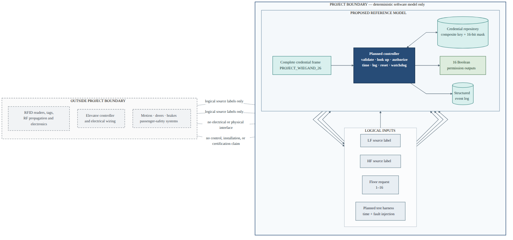
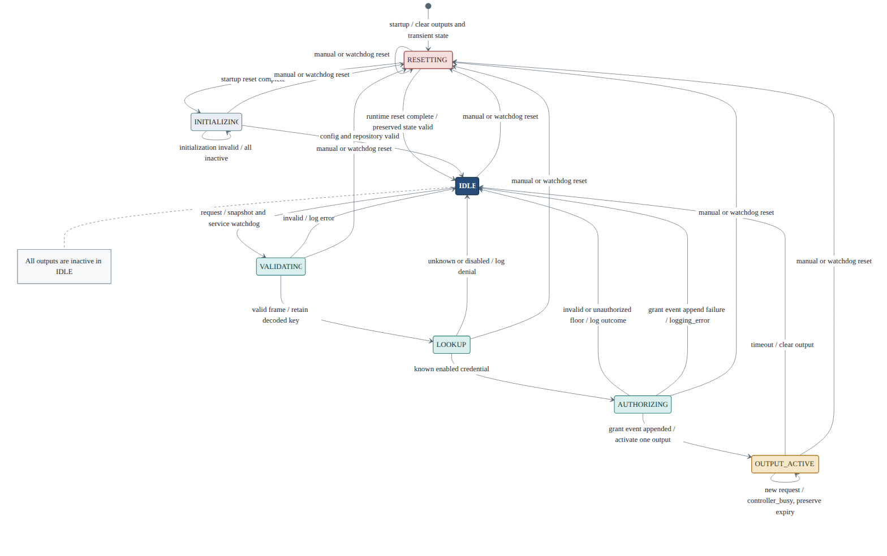
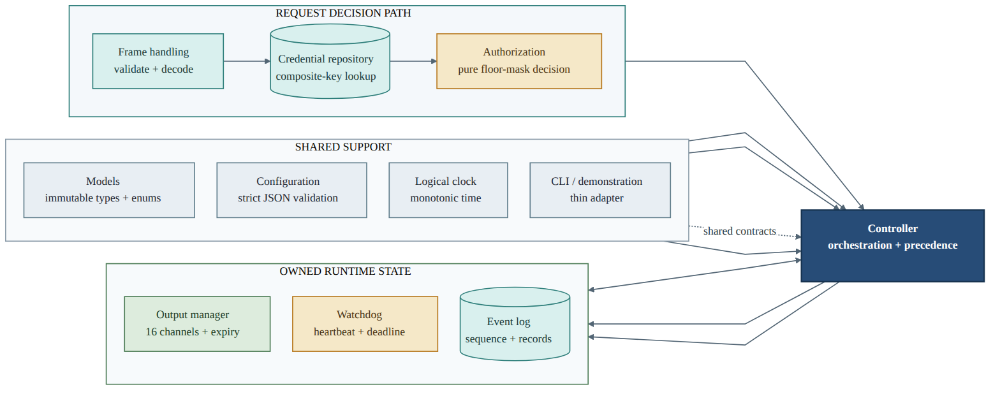

# ADVANCEMENT REPORT 1

**Final Project Controlled Floor Elevator**

**B.Sc. Final Engineering Project**

**Student:** Bar Shtainvortzel

**Supervisor:** Professor Gadi Golan

**Department of Electrical and Electronics**

**Faculty of Engineering**

**Ariel University**

## 1. Introduction and Project Objective

Floor-selective elevator access can be treated as a bounded authorization problem. A request supplies credential information and a requested floor; the access layer must validate the credential representation, identify the corresponding authorization record, determine whether that floor is permitted, expose a logical permission output for a limited interval, and record the decision. Each step must have an explicit outcome so that grants, denials, invalid input, timeout, and recovery can be verified independently.

The project objective is to develop a deterministic software reference model for a 16-floor credential-based elevator access-control layer. The planned model starts after physical reader acquisition, with one complete logical credential frame, a logical reader-source label, and a floor request. It ends with a typed decision, one of 16 abstract Boolean permission channels, and a structured event record. Logical `LF` and `HF` labels retain source metadata but do not simulate antennas, modulation, radio propagation, or frequency detection.

The boundary is intentionally limited to access authorization. Elevator movement, motors, brakes, doors, installation wiring, and passenger-safety functions are outside the project. The logical permission outputs are therefore decision signals, not commands to physical elevator equipment. Figure 1 summarizes this boundary as it had been defined at the end of the first reporting period.

{#fig-system-context width=96%}

## 2. Work Completed During the First Project Phase

### 2.1 Literature and Technical Background

The initial study separated the authorization problem into technology layers. NIST describes RFID systems using tag, reader, and downstream processing roles, and distinguishes operating-frequency classes from identifier formats [1]. This supported treating `LF` and `HF` as supplied metadata rather than attempting to infer radio behavior from a credential number. BALTECH documentation supplied a bounded example of D0/D1 bit signaling, variable frame lengths, and parity-bearing Wiegand frames [2]. The selected 26-bit allocation remained a project-defined profile rather than a universal interface specification.

Authorization and auditability were grounded in general access-control concepts. NIST guidance discusses authorization credentials or access lists, verification before access is granted, and maintenance of access-event records [3]. Representative embedded-controller manuals were reviewed for memory organization, initialization, timers, interrupts, reset, and watchdog concepts [4], [5]. These sources informed terminology and architectural decomposition without selecting physical hardware. NASA software-engineering guidance supported bidirectional requirements traceability, controlled test procedures, unit and integration testing, and evaluation against expected results [6].

### 2.2 System Requirements

The requirement baseline contained 60 required requirements and six optional requirements. The required set defined the complete minimum software-model behavior; optional extensions were separated so they could not delay implementation of the central authorization path. Table 1 condenses the main requirements rather than repeating the full catalog.

**Table 1. Principal requirements defined during the first reporting period.**

| Area | Defined requirement |
|---|---|
| Scope | Software-only access-authorization layer for floors 1–16; no physical motion or safety control |
| Logical input | One complete frame, one `LF` or `HF` metadata label, and one requested floor |
| Credential profile | Project-defined 26-bit frame with exact length, binary-value, field, and parity rules |
| Identity | Ordered `(facility_code, credential_number)` lookup key with deterministic duplicate rejection |
| Permission data | Enabled/disabled record and unsigned 16-bit mask; floor 1 maps to bit 0 and floor 16 to bit 15 |
| Decision behavior | Distinct grant, denial, and invalid-input reasons with no activation on a failed request |
| Output behavior | Exactly 16 logical channels, at most one active, bounded duration, and deterministic busy handling |
| Time and recovery | Injectable monotonic time, manual reset, watchdog supervision, and post-reset recovery |
| Observability | Ordered structured events for decisions, validation errors, timeout, and reset |

The required output duration was defined as a configurable logical interval from 100 to 30,000 ms, with a 3,000 ms default. The watchdog default was 2,000 ms. All timing requirements referred to simulated monotonic time so later verification could advance directly to boundaries without real waiting. Invalid startup data was designed to leave the model non-operational with all logical outputs inactive. Runtime reset was designed to clear transient and output state while preserving valid configuration, credential records, and earlier events.

## 3. Proposed System Architecture

The conceptual architecture assigned each mutable state category to one owner and kept the authorization decision path independent of physical acquisition and actuation. A complete frame would pass through source and frame validation, parity checking, decoding, composite-key lookup, enabled-state checking, floor validation, and 16-bit mask evaluation. A grant event would be recorded before output activation so that a logging failure could not create an unrecorded grant. Denial or invalid input would create no new activation.

The controller state model contained seven states: `RESETTING`, `INITIALIZING`, `IDLE`, `VALIDATING`, `LOOKUP`, `AUTHORIZING`, and `OUTPUT_ACTIVE`. Busy handling was given priority over inspection of a new request. While a permission output was active, any new request would be denied as busy without replacing the output or extending its expiry. Timeout would return the controller to idle, while manual or watchdog reset could interrupt any modeled state and restore the defined logical baseline.

{#fig-state-machine width=94%}

The architecture also defined an abstract logical register and memory view for design inspection and testing. It covered configuration, request and decoded fields, controller state, the floor mask, output state, expiry, watchdog service time, and latest event values. These were documentation offsets and observable software concepts only; no processor memory map, voltage, connector, or peripheral address was selected.

## 4. Software Design

The software architecture was defined as a Python 3.11-or-later package with narrow, acyclic dependencies. Planned modules covered shared models, strict configuration parsing, a simulated clock, credential-frame handling, a credential repository, pure authorization, output ownership, watchdog state, event logging, controller orchestration, and a thin demonstration interface. The planned implementation would use standard-library facilities with `pytest` for verification.

{#fig-module-architecture width=94%}

Immutable records and enumerations were specified for requests, decoded credentials, credential records, decisions, events, configuration, output snapshots, and controller snapshots. Expected access outcomes were designed as typed result/reason pairs rather than exception-driven branches. Exceptions were reserved for invalid startup data, injected infrastructure failure, clock misuse, and internal invariant violations.

Configuration and credential data were designed as strict UTF-8 JSON documents. Required fields, types, ranges, schema version, and unknown-field rejection were defined, and loading was specified as all-or-nothing. The credential repository would retain validated records in memory and use the ordered facility-code and credential-number pair as its key. Events were designed as immutable nine-field records with monotonically increasing sequence numbers, simulated timestamps, explicit null values where data were unavailable, and deterministic JSON Lines export.

The controller was designed as the orchestrator rather than the owner of every component's data. The output manager alone would own the 16-channel tuple, active floor, and expiry. The event log would own records and sequence allocation. The watchdog would own its service deadline and fault-suppression state. This separation was intended to make atomic updates, reset preservation, and unit testing straightforward.

## 5. Verification Plan

Verification was designed before production implementation. The requirements-to-test traceability matrix linked 69 distinct planned test identifiers, while the expanded verification inventory contained 100 designed cases. At this point these were specifications of controlled inputs, expected outcomes, states, and events—not executed pass results.

**Table 2. Planned verification coverage.**

| Verification area | Planned verification |
|---|---|
| Credential frame | Valid reference vectors, wrong length, non-binary values, parity corruption, decode boundaries, and both source labels |
| Credential repository | Empty, known, unknown, disabled, duplicate, invalid-record, composite-key, and ordering cases |
| Authorization | Floors 1 and 16, invalid types and ranges, every floor-mask bit, and every grant/denial reason |
| Output control | Correct single-channel activation, before/at-expiry boundaries, timeout idempotence, and busy-state preservation |
| Watchdog and reset | Heartbeat service, service suppression, deadline collision, manual reset, watchdog reset, and later recovery |
| Event logging | Schema, explicit nulls, ordering, sequence allocation, serialization, and injected append failure |
| Integration | Complete request-to-decision-to-event scenarios, state transitions, failure containment, and deterministic replay |
| Scalability | Deterministic workloads at 10, 100, 1,000, and 10,000 credential records with recorded host context |

The planned levels were unit, integration, end-to-end, deterministic fault injection, inspection, replay, and scalability observation. Time-dependent tests would use a fresh simulated clock and would not sleep or depend on thread scheduling. Fault testing would suppress watchdog service or inject an event-append failure through explicit interfaces. Later execution records were expected to retain controlled input, expected and actual outcomes, state/event observations, and pass/fail evaluation.

## 6. Engineering Challenges and Decisions

One central challenge was reconciling a 3,000 ms default permission duration with a 2,000 ms watchdog timeout. A watchdog that was armed once and never serviced would reset a normal authorization before its output expired. The design therefore introduced an internal logical heartbeat interval:

`heartbeat_interval_ms = max(1, watchdog_timeout_ms // 2)`

The chronological scheduler was designed to jump directly between due timestamps. At a shared timestamp, normal heartbeat service would be processed first, watchdog expiry second, and output expiry third. With normal service, heartbeats at 1,000 ms intervals would keep the default watchdog serviced until the output timed out at 3,000 ms. Under deliberate service suppression, the watchdog would instead request one reset at 2,000 ms. If watchdog expiry and output expiry collided during suppression, watchdog reset would take precedence and cancel the pending output timeout.

Other important decisions concerned determinism and ownership. Busy detection would occur before reading the new request, making concurrency behavior independent of whether that request was valid. At most one permission channel could be active, and channel state, active floor, and expiry would update together. Strict schemas would reject wrong types, unknown fields, invalid ranges, and duplicate credential keys without partial publication. Reset would clear transients and outputs but preserve validated long-lived state. Designing these rules before coding reduced ambiguity in the planned module tests and integration scenarios.

## 7. Current Status at the End of the Reporting Period

At the end of the first reporting period, the engineering problem and safety boundary had been defined; the literature background and requirement catalog had been prepared; and the system architecture, logical state model, data flow, register concepts, software module contracts, schemas, APIs, watchdog/reset behavior, verification strategy, detailed test inventory, and implementation sequence had been completed.

The project was ready to move from design into implementation. Production Python modules had not yet been created, executable test files had not yet been written, and no verification run, scalability experiment, timing measurement, or graph had been produced. Consequently, this report makes no implementation-conformance or performance claim.

## 8. Planned Work for the Next Period

**Table 3. Planned work after the design and verification-planning period.**

| Sequence | Planned activity |
|---:|---|
| 1 | Create the Python package foundation, immutable models, configuration validation, and logical clock |
| 2 | Implement credential-frame validation and decoding, credential lookup, and authorization |
| 3 | Implement event logging, output timing, watchdog behavior, and controller integration |
| 4 | Add strict file loaders and a thin offline demonstration interface |
| 5 | Implement the designed unit, integration, end-to-end, replay, and fault-injection tests |
| 6 | Execute verification and reconcile every required requirement with recorded evidence |
| 7 | Run the planned quantitative and scalability experiments and analyze their limitations |
| 8 | Prepare the final engineering report using the resulting implementation and verification evidence |

## 9. Conclusion

The first project period established a complete, bounded, and testable engineering design for a deterministic 16-floor access-authorization reference model. Requirements, architecture, software contracts, timing and recovery rules, and verification cases were aligned before implementation began. The resulting foundation was ready for disciplined construction and later evidence-based evaluation, but it did not yet constitute an implemented or verified system.

## References

[1] T. Karygiannis, B. Eydt, G. Barber, L. Bunn, and T. Phillips, *Guidelines for Securing Radio Frequency Identification (RFID) Systems*, NIST Special Publication 800-98, Apr. 2007, doi: 10.6028/NIST.SP.800-98.

[2] BALTECH, “Wiegand specification,” official access-reader documentation. [Online]. Available: https://docs.baltech.de/developers/wiegand.html. Accessed: Jul. 29, 2026.

[3] Joint Task Force, *Security and Privacy Controls for Information Systems and Organizations*, NIST Special Publication 800-53, Revision 5, Sep. 2020, updated Dec. 10, 2020, doi: 10.6028/NIST.SP.800-53r5.

[4] STMicroelectronics, *STM32F101xx, STM32F102xx, STM32F103xx, STM32F105xx and STM32F107xx Advanced ARM-Based 32-Bit MCUs*, RM0008, DocID13902 Rev. 15, Jun. 2014.

[5] Marvell, *ARMADA 38x Family Functional Specifications—Unrestricted*, MV-S109094-U0 Rev. A, preliminary, Nov. 25, 2015.

[6] National Aeronautics and Space Administration, “NASA Software Engineering Handbook, Version D,” SWE-052, SWE-062, SWE-065, and SWE-068 guidance. [Online]. Available: https://swehb.nasa.gov/. Accessed: Jul. 29, 2026.
