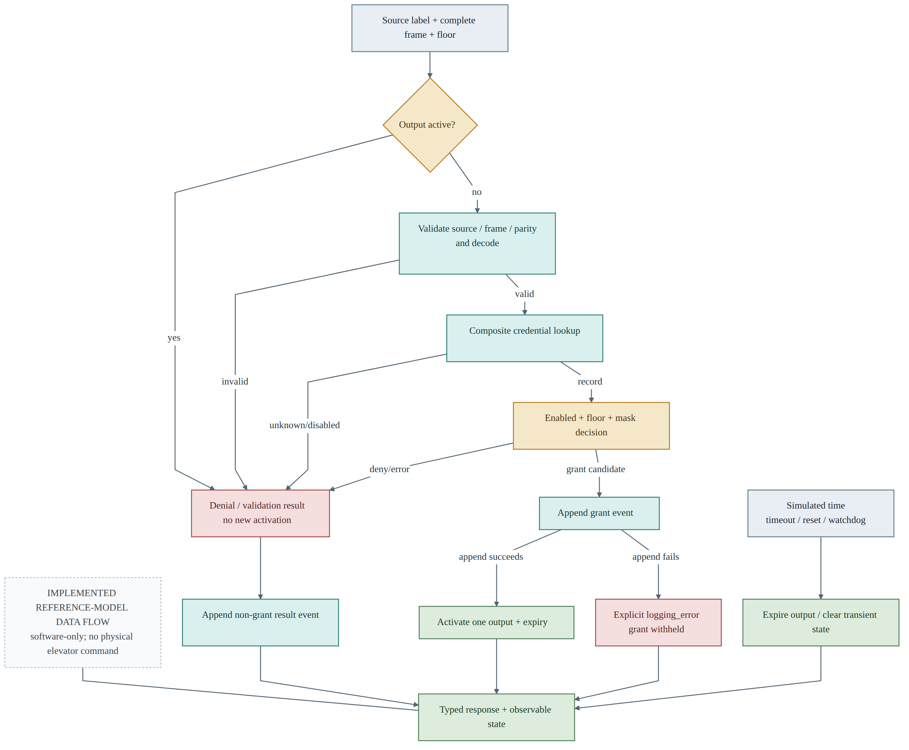
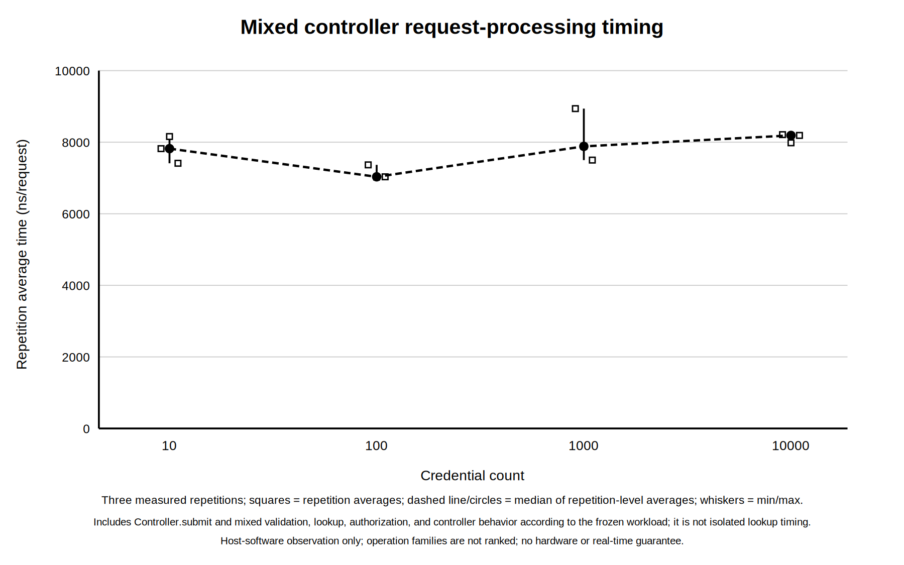
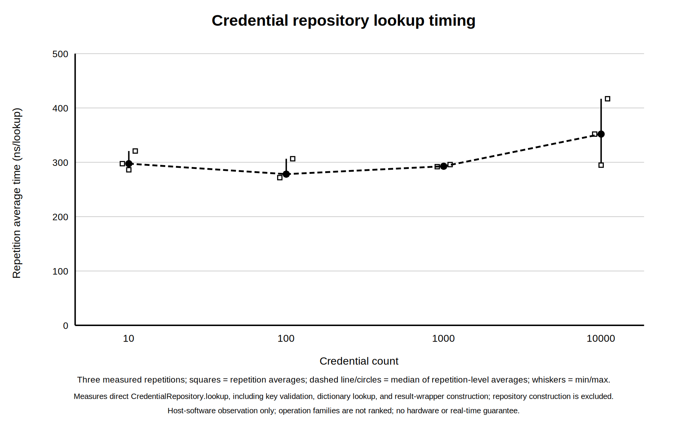
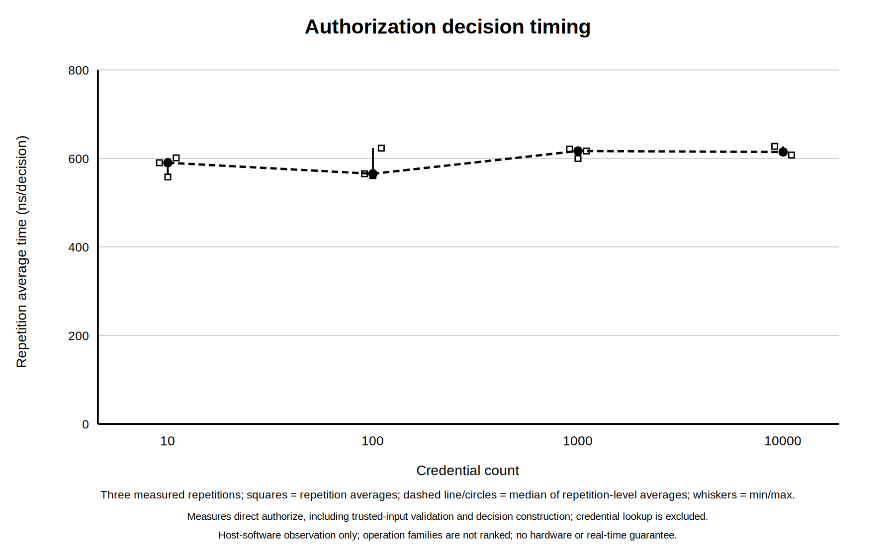

# ADVANCEMENT REPORT 2

**Final Project Controlled Floor Elevator**

**Implementation, Verification, and Results**

**B.Sc. Final Engineering Project**

**Student:** Bar Shtainvortzel

**Supervisor:** Professor Gadi Golan

**Department of Electrical and Electronics**

**Faculty of Engineering**

**Ariel University**

**Reporting cutoff:** 3 August 2026

## 1. Introduction and Project Objective

The first advancement period established the requirements, architecture, module contracts, timing rules, and verification plan for a floor-selective access-control model. The second period converted that design into an executable and verified software reference model. This report records the engineering state at the end of that implementation-and-results period; it does not describe work performed later for final academic submission.

The project objective remained a deterministic software model of the access-control layer for a 16-floor elevator. A request contains a complete credential frame, a logical reader-source label, and a requested floor. The model validates and decodes the frame, retrieves an authorization record, evaluates enabled state and floor permission, produces a typed outcome, controls one of 16 abstract Boolean permission channels for a bounded duration, and appends a structured event. Logical `LF` and `HF` source labels are metadata and do not model antennas, carrier frequencies, modulation, or radio propagation. NIST's layered description of RFID systems supported this separation between acquisition technology and downstream identifier processing [1].

The boundary also remained unchanged: the model does not command elevator motion, motors, brakes, doors, or safety equipment. Its outputs are observable logical permissions for software verification, not signals validated for installation. Within that boundary, the period objective was achieved: the designed components were implemented, the required requirements were verified, deterministic experiments were executed, and their limitations were recorded.

## 2. Implementation Progress

The software reference-model package was implemented in Python using standard-library components and explicit immutable data records. Shared models define requests, decoded credentials, stored credentials, decisions, events, configuration, output snapshots, and controller snapshots. Expected access outcomes are represented by typed status-and-reason values; exceptions are reserved for invalid startup data, controlled infrastructure faults, clock misuse, and internal invariant violations.

Strict configuration loading validates UTF-8 JSON structure, schema version, required fields, unknown fields, types, and ranges before publishing any configuration. An injectable monotonic clock provides deterministic time without wall-clock waiting. The credential-frame component implements the project-defined 26-bit profile, including exact length and binary-value validation, leading and trailing parity checks, and field decoding. This is a bounded project profile rather than a claim that every Wiegand installation uses the same allocation; published Wiegand documentation shows that frame lengths and parity arrangements may vary [2].

Credential records are indexed by the ordered composite key `(facility_code, credential_number)`, preventing two facility codes with the same credential number from being treated as one identity. Loading rejects duplicate keys and invalid records atomically. Each record includes an enabled/disabled state and an unsigned 16-bit floor mask. Floor 1 maps to bit 0 and floor 16 to bit 15. Pure authorization logic distinguishes a grant, an unknown credential, a disabled credential, an unauthorized floor, and an invalid floor.

Output management owns the 16-channel tuple, active floor, and expiry as one state. At most one channel can be active. A controller grant activates exactly the requested channel; timeout clears it. Busy handling has priority over examination of a new request and does not replace or extend the existing activation. The event log assigns ordered sequence numbers and stores canonical records for requests, validation failures, denials, grants, timeouts, and resets. A grant is logged before activation, so an injected append failure produces `logging_error` and withholds the grant.

Manual reset and watchdog reset clear transient controller and output state while preserving valid configuration, credential records, and earlier events. The watchdog is serviced by a deterministic logical heartbeat during normal activity. Service can be suppressed for controlled fault testing. A thin command-line interface supports offline demonstration with validated configuration and credential inputs; it remains outside the safety-critical boundary.

**Table 1. Component status at the reporting cutoff.**

| Component area | Implemented state |
|---|---|
| Data and configuration | Typed records, strict schemas, validation, and atomic loading implemented |
| Credential path | 26-bit validation, parity checking, decoding, composite-key lookup, and duplicate rejection implemented |
| Authorization | Enabled-state, floor-range, and all 16 mask-bit decisions implemented |
| Controller outputs | Sixteen logical channels, single-active invariant, busy policy, and bounded activation implemented |
| Observability | Structured ordered events, deterministic serialization, snapshots, and reason codes implemented |
| Time and recovery | Simulated clock, chronological scheduling, timeout, manual reset, heartbeat, and watchdog reset implemented |
| Demonstration | Offline command-line request execution and state/event display implemented |

## 3. Controller Operation

Figure 1 shows the implemented request path. A request first encounters the busy rule. If no output is active, source and frame validation, parity checking, and decoding precede repository lookup and authorization. Unknown, disabled, unauthorized-floor, invalid-frame, and invalid-floor results cannot create an output activation. A grant candidate is also prevented from activating if its event cannot be appended. This ordering provides a directly testable software invariant: every activated permission has a preceding recorded grant.

{#fig-controller-flow width=94%}

The time scheduler processes due logical events chronologically. With the default 3,000 ms permission duration and 2,000 ms watchdog timeout, the internal heartbeat services the watchdog every 1,000 ms during normal activity. Under deliberate service suppression, watchdog expiry requests reset. When watchdog expiry and output expiry occur at the same timestamp, watchdog reset takes precedence and cancels the pending timeout. These rules make boundary results reproducible and independent of operating-system scheduling.

## 4. Verification Executed

Verification was executed at unit, integration, end-to-end, inspection, deterministic fault-injection, and experiment-analysis levels. The frozen suite at this reporting cutoff collected 976 tests and passed all 976, with zero failures, zero skipped tests, and zero expected failures. These are the historical results for this report; later repository-suite counts are not used as evidence here.

The requirement trace contained 60 required requirements, all verified. The detailed verification inventory contained 100 records: 94 executed records passed, while six optional records were explicitly deferred. The deferred records were non-mandatory extensions and did not weaken the verified required baseline. Pass status was supported by controlled input, expected result, actual result, and observation of relevant decision, state, output, or event data.

**Table 2. Verification performed and principal observations.**

| Area | Executed coverage and result |
|---|---|
| Frame and parity | Valid reference frames, exact length, non-binary data, both parity regions, field boundaries, and both logical source labels passed |
| Repository and authorization | Empty/known/unknown/disabled records, composite keys, duplicates, invalid records, floors 1 and 16, invalid floors, and every one of the 16 mask bits passed |
| Controller and outputs | Grant, every denial class, single-channel activation, before/at-expiry behavior, busy preservation, and repeated timeout behavior passed |
| Time, reset, and watchdog | Heartbeat service, service suppression, deadline collision, manual reset, watchdog reset, preserved long-lived state, and recovery to later service passed |
| Events and configuration | Strict loading, schema rejection, ordered event fields, explicit nulls, sequence allocation, serialization, and append-failure containment passed |
| Integration and end-to-end | Full request-to-result paths, state transitions, fault paths, deterministic replay, and command-line execution passed |
| Frozen suite summary | **976 collected; 976 passed; 0 failed; 0 skipped; 0 expected failures** |
| Requirement status | **60 required verified; 6 optional verification records deferred** |

The verification approach followed the principle that software requirements should be traced to controlled tests and evaluated against expected results [4]. It establishes conformance of the model to its stated requirements for the executed cases. It does not certify physical elevator equipment, reader electronics, installation wiring, or passenger safety.

## 5. Quantitative Functional Results

Two deterministic workloads were used to examine result accounting beyond individual tests. They reused generated credential sets at four repository sizes—10, 100, 1,000, and 10,000 records—and recorded exact outcome counts. No random acceptance criterion or statistical extrapolation was applied.

The mixed controller workload processed 39,000 requests. It produced 15,600 grants, 19,500 denials, and 3,900 invalid-input results, with zero unclassified outcomes. Denials were further reconciled into 7,800 unauthorized-floor, 5,850 disabled-credential, and 5,850 unknown-credential results; those three categories sum exactly to the denial total.

**Table 3. Mixed controller workload outcomes.**

| Outcome | Count | Share of 39,000 |
|---|---:|---:|
| Grant | 15,600 | 40% |
| Denial: unauthorized floor | 7,800 | 20% |
| Denial: disabled credential | 5,850 | 15% |
| Denial: unknown credential | 5,850 | 15% |
| Invalid input | 3,900 | 10% |
| Other or unclassified | 0 | 0% |
| **Total** | **39,000** | **100%** |

The isolated workload contained 24,000 operations. The 12,000 lookup operations produced 6,000 expected hits and 6,000 expected misses, with no mismatch. The 12,000 authorization operations produced 4,800 correct grants, 6,000 correct denials, and 1,200 correct invalid-floor errors. No incorrect grant, incorrect denial, or other mismatch was observed.

**Table 4. Isolated lookup and authorization results.**

| Operation class | Expected/observed category | Count | Mismatch |
|---|---|---:|---:|
| Lookup | Hit | 6,000 | 0 |
| Lookup | Miss | 6,000 | 0 |
| Authorization | Correct grant | 4,800 | 0 |
| Authorization | Correct denial | 6,000 | 0 |
| Authorization | Correct invalid-floor error | 1,200 | 0 |
| **Total** | **All isolated operations** | **24,000** | **0** |

These totals provide additional evidence that the implemented categories were mutually accounted for in the generated workloads. They do not prove absence of defects outside the tested input construction.

## 6. Timing Observations

Timing observations were collected on one host using `time.perf_counter_ns`. Mixed controller processing, repository lookup, and isolated authorization were bounded and timed as separate operations. Each repository size had three repetition aggregates. Figures 2–4 display the accepted median of the repetition-average series for sizes 10, 100, 1,000, and 10,000.

The mixed-controller timing conditions did not use identical call counts at every repository size: the 10-, 100-, and 1,000-record conditions used 1,000 calls per repetition, while the 10,000-record condition used 10,000 calls per repetition. The reported values are repetition-average timings, but this workload difference should still be considered when interpreting cross-size observations.

{#fig-mixed-timing width=80%}

The isolated plots are presented separately because their timed boundaries exclude controller orchestration.

{#fig-lookup-timing width=84%}

{#fig-authorization-timing width=84%}

**Table 5. Accepted median repetition-average timing series.**

| Credential records | Mixed controller (ns) | Lookup (ns) | Authorization (ns) |
|---:|---:|---:|---:|
| 10 | 7,820.085 | 297.496 | 590.139 |
| 100 | 7,032.656 | 278.224 | 565.264 |
| 1,000 | 7,882.918 | 292.728 | 616.682 |
| 10,000 | 8,189.5002 | 351.938 | 614.437 |

The observed series are non-monotonic: for example, the 100-record measurements are below the 10-record measurements in all three operation classes. Host activity, interpreter behavior, cache effects, and measurement overhead can influence such small durations. The data therefore support only a descriptive statement about these runs on this host. They do not establish statistical significance, real-time deadlines, constant-time behavior, platform-independent latency, or an asymptotic complexity class.

## 7. Discussion of Results

The strongest legitimate conclusion is functional: the implemented software reference model satisfied the 60 required requirements under its deterministic verification campaign, all 976 frozen tests passed, and both quantitative workloads reconciled without mismatched or unclassified outcomes. Boundary cases were not limited to typical floors or valid credentials; the campaign included both parity regions, floors 1 and 16, all 16 permission bits, invalid floors, busy behavior, exact timeout boundaries, reset, watchdog collision, logging failure, configuration rejection, and replay.

The results also support a structural conclusion. Separating validation, lookup, pure authorization, event ownership, output ownership, and recovery made failures observable by reason and reduced ambiguous shared state. Logging before activation and a single owner for output state made the grant invariant directly testable. These properties are relevant to access-control auditability, for which authorization checks and event records are established security-control concepts [3].

Several broader conclusions would be illegitimate. A passing reference model is not evidence that physical readers correctly acquire signals or that elevator hardware responds safely. Generated workloads do not represent every deployment distribution or adversarial condition. The timing samples are not a benchmark across hosts and do not support a maximum-response-time guarantee. Finally, a finite passing suite cannot prove the absence of all defects; it provides repeatable evidence against defined requirements and cases.

## 8. Engineering Challenges

The main implementation challenge was preserving deterministic behavior where timeout, watchdog, reset, and busy handling interact. The heartbeat interval had to keep the default 3,000 ms activation compatible with a 2,000 ms watchdog while still permitting a reproducible watchdog fault. Direct chronological advancement and a documented same-timestamp precedence rule avoided sleeps and scheduling races.

A second challenge was failure atomicity. Configuration and credential data had to be fully validated before publication; output fields had to change as one state; and an event-append failure had to withhold a grant. Explicit owners and injected fault interfaces made these cases testable without depending on uncontrolled environmental failure.

The quantitative work introduced a different challenge: preventing convenient graphs from becoming stronger claims than the evidence allowed. Separate operation boundaries, exact category reconciliation, three repetition aggregates, and recorded host context improved reproducibility. The non-monotonic series nevertheless required restrained interpretation rather than a complexity or real-time claim.

## 9. Status at the Reporting Cutoff

At the 3 August 2026 cutoff, the required software reference model was implemented and its frozen verification campaign was complete. The controller, all supporting modules, strict data loaders, command-line demonstration, fault and recovery paths, traceability evidence, quantitative workloads, results tables, and timing plots were available. All 60 required requirements were verified; six optional verification records remained deferred by design.

The remaining work was academic consolidation rather than completion of missing required controller behavior. It included preparing the final report, selecting concise figures and evidence, checking citation and terminology consistency, producing the final document formats, preparing the presentation and demonstration material, rehearsing the defence, and completing supervisor review and submission. These activities were pending at this historical cutoff.

## 10. Planned Final Work

**Table 6. Work planned after the second reporting period.**

| Sequence | Planned activity | Intended result |
|---:|---|---|
| 1 | Consolidate the technical evidence | Coherent final engineering-report narrative |
| 2 | Select final figures, tables, and accepted plots | Legible evidence without unsupported claims |
| 3 | Audit terms, numbers, citations, and cross-references | Submission-ready technical text |
| 4 | Produce and inspect the final DOCX and PDF | Consistent document deliverables |
| 5 | Prepare presentation slides and a bounded software demonstration | Clear explanation of scope, operation, and results |
| 6 | Rehearse scope, verification-limit, and timing questions | Defence readiness |
| 7 | Incorporate supervisor feedback and prepare submission | Reviewed final academic package |

## 11. Conclusion

During the second advancement period, the previously specified 16-floor access-control design became an implemented, deterministic software reference model. Its complete required baseline was verified: 976 of 976 frozen tests passed, all 60 required requirements had evidence, and six optional records were transparently deferred. Mixed and isolated workloads produced fully reconciled functional outcomes, while timing plots supplied descriptive, host-specific observations with explicitly limited claims. At the cutoff, the engineering implementation and required verification were complete, and the project was ready for final academic reporting, presentation, review, and submission work.

## References

[1] T. Karygiannis, B. Eydt, G. Barber, L. Bunn, and T. Phillips, *Guidelines for Securing Radio Frequency Identification (RFID) Systems*, NIST Special Publication 800-98, Apr. 2007, doi: 10.6028/NIST.SP.800-98.

[2] BALTECH, “Wiegand specification,” official access-reader documentation. [Online]. Available: https://docs.baltech.de/developers/wiegand.html. Accessed: Jul. 29, 2026.

[3] Joint Task Force, *Security and Privacy Controls for Information Systems and Organizations*, NIST Special Publication 800-53, Revision 5, Sep. 2020, updated Dec. 10, 2020, doi: 10.6028/NIST.SP.800-53r5.

[4] National Aeronautics and Space Administration, “NASA Software Engineering Handbook, Version D,” SWE-052, SWE-062, SWE-065, and SWE-068 guidance. [Online]. Available: https://swehb.nasa.gov/. Accessed: Jul. 29, 2026.
